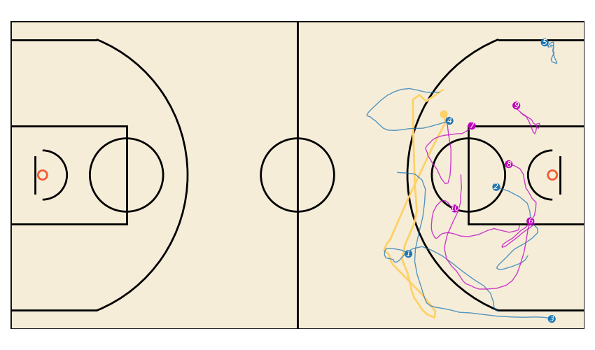
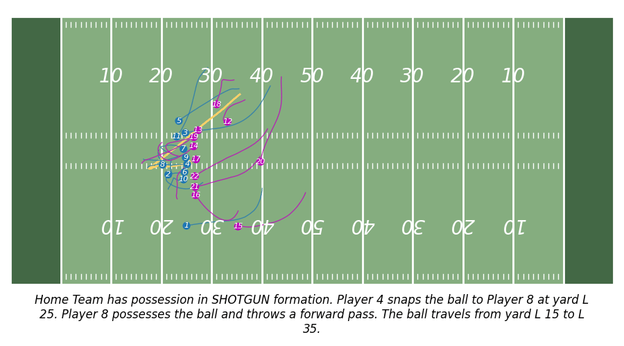
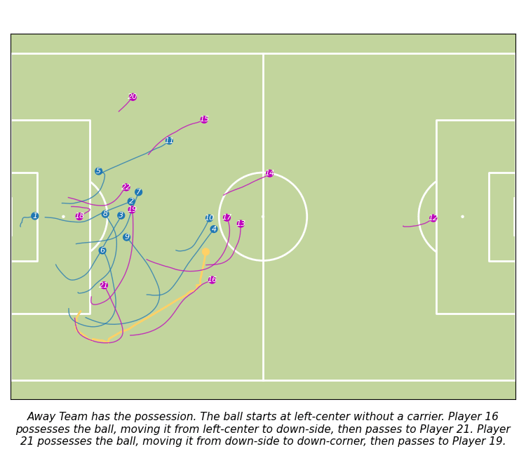

# **JointDiff: A Unified Sports Trajectory Benchmark**

Official repository for **JointDiff**, a sports trajectory benchmark accepted at **ICLR 2026**.

**JointDiff** provides a **unified dataset interface and evaluation protocol** for multi-agent trajectory forecasting, imputation, and controllable generation across three major team sports: **NBA** (Basketball), **NFL** (Football), and **Bundesliga** (Soccer).

It is designed to evaluate **global scene coherence** and **controllability** in complex, long-horizon, multi-agent environments.

## **🚀 Overview**

JointDiff unifies diverse sports tracking data into a single representation, supporting three core tasks:

1. **Trajectory Forecasting**: Predicting future movements of all agents.  
2. **Trajectory Imputation**: Reconstructing missing in-between frames.  
3. **Controllable Generation**: Guiding trajectories via "weak-possession" or natural language prompts.

## **📊 Supported Datasets**

We unify three public tracking datasets. All data is exposed through a single AllSports class, ensuring consistent training and testing splits.

| Dataset | Sport | Source | Scenes (Train / Test) | Duration | Resolution (FPS) | Agents |
| :---- | :---- | :---- | :---- | :---- | :---- | :---- |
| **NBA** | Basketball | [SportVU](https://github.com/linouk23/NBA-Player-Movements) | 32.5k / 12k | 6.0s | 5 (T=30) | 11 |
| **NFL** | Football | [Big Data Bowl](https://github.com/nfl-football-ops/Big-Data-Bowl) | 10.8k / 2.6k | 5.0s | 10 (T=50) | 23 |
| **Bundesliga** | Soccer | [IDSSE](https://github.com/spoho-datascience/idsse-data) | 2.1k / 524 | 6.4s | 6.25 (T=40) | 23 |

**Note:** NFL and Bundesliga scenes are augmented with **natural-language captions** to support text-guided generation.

## **📦 Installation**

Install the core dependencies:

```bash
pip install numpy torch matplotlib mplsoccer
```

**Optional:** If you intend to use text-guided generation (NFL/Bundesliga), install the transformers library for embeddings:

```bash
pip install transformers
```

Download the data folder from this Google Drive (not available yet).

## **💻 Usage**

### **Quick Start**

Load any of the three sports using the unified AllSports interface.

```bash
from dataset_all_sports import AllSports

# Initialize dataset
ds = AllSports(
    name_sport='bundes',   # Options: 'nba', 'nfl', 'bundes'
    split_name='train',    # Options: 'train', 'test'
    obs_len=10,            # Frames used for observation
    fut_obs=None,          # Set specific length for imputation (e.g., fut_obs=1)
    captions=True,         # Enable text annotations (NFL & Bundes only)
    text_embeddings=False, # Set True to return pre-computed T5 embeddings
)

# Fetch a sample
# agents_in: Dummy
# agents_out: Ground truth scene
# labels: Metadata (including captions if enabled)
agents_in, agents_out, labels = ds[0]

print(f"Output Shape: {agents_out.shape}")
print(f"Available Labels: {labels.keys()}")

# --- Normalization ---
# The dataset returns normalized coordinates for stable training.
xy_norm = agents_out[..., :2]

# To revert to real-world units (Meters or Yards), use batch_unnorm:
xy_unnorm = ds.batch_unnorm(xy_norm)
```

### **Visualization**

To visualize trajectories, we provide a helper script. Ensure ffmpeg is installed on your system.

```bash
python dataset_all_sports.py
```

#### **Qualitative Examples**

| NBA  |
| :---- | 
|  | 

| NFL  |
| :---- | 
|  |

| Bundes  |
| :---- | 
|  |

---

## **📏 Metrics**

We evaluate performance using scene-level and agent-level metrics. Since trajectory generation is stochastic, we report **min** (best of $K$) and **avg** (average of $K$) metrics, where $K=20$.

### **Scene Metrics (Global Coherence)**

Evaluates the joint distribution of all agents simultaneously.

* **SADE (Scene Average Displacement Error)**: The L2 distance between predicted and ground-truth positions, averaged over all agents and all time steps for the *best matching scene*.  
* **SFDE (Scene Final Displacement Error)**: The L2 distance between predicted and ground-truth positions, averaged over all agents at the *final time step* for the best matching scene.

### **Agent Metrics (Individual Motion)**

Evaluates each agent independently, ignoring global consistency.

* **ADE (Average Displacement Error)**: Standard L2 error averaged over time for a single agent.  
* **FDE (Final Displacement Error)**: Standard L2 error at the final time step for a single agent.

### **Controllability**

* **Accuracy (Acc)**: The percentage of generated samples that satisfy the guidance condition (e.g., did the designated player receive the pass?).

---

## **🏆 Benchmark Results**

### **1\. Completion Generation (Global Coherence)**

Evaluates the realism of the entire scene. Lower is better ($\downarrow$). *Metrics: Scene ADE (SADE) / Scene FDE (SFDE) \- Reported as **min / avg** over 20 modes.*

| Method | Gen | IID | NFL SADE (yds) | NFL SFDE (yds) | Bundes SADE (m) | Bundes SFDE (m) | NBA SADE (m) | NBA SFDE (m) |
| :---- | :---- | :---- | :---- | :---- | :---- | :---- | :---- | :---- |
| **Future Generation** |  |  |  |  |  |  |  |  |
| GroupNet <sub>CVPR22</sub> | $\checkmark$ | $\checkmark$ | $4.42 / 5.33$ | $10.01 / 12.18$ | $4.78 / 5.76$ | $9.58 / 11.63$ | $2.12 / 2.84$ | $3.72 / 5.15$ |
| AutoBots <sub>ICLR22</sub> | $\times$ | $\times$ | $3.02 / 4.82$ | $6.33 / 10.68$ | $3.33 / 5.93$ | $5.57 / 11.46$ | $1.75 / 2.73$ | $2.73 / 4.71$ |
| LED<sup>IID</sup> <sub>CVPR23</sub> | $\checkmark$ | $\checkmark$ | $3.48 / 4.12$ | $7.95 / 9.63$ | $3.89 / 4.58$ | $8.06 / 9.74$ | $1.77 / 2.30$ | $3.25 / 4.45$ |
| LED <sub>CVPR23</sub>| $\checkmark$ | $\times$ | $-$ | $-$ | $-$ | $-$ | $1.63 / 3.83$ | $2.99 / 6.03$ |
| MART <sub>ECCV24</sub> | $\times$ | $\times$ | $2.55 / 4.26$ | $5.99 / 10.31$ | $\underline{2.50} / \underline{4.16}$ | $\underline{5.06} / \underline{9.00}$ | $1.52 / 2.46$ | $2.77 / 4.78$ |
| MoFlow <sub>CVPR25</sub> | $\checkmark$ | $\times$ | $\mathbf{2.33} / 4.02$ | $\mathbf{5.51} / 9.98$ | $2.51 / 4.21$ | $5.08 / 9.24$ | $1.52 / 2.42$ | $2.73 / 4.64$ |
| U2Diff <sub>CVPR25</sub> | $\checkmark$ | $\checkmark$ | $2.59 / \underline{3.74}$ | $5.97 / \underline{9.02}$ | $2.69 / 4.21$ | $5.46 / 9.44$ | $\underline{1.48} / \underline{2.12}$ | $\underline{2.68} / \underline{4.14}$ |
| **JointDiff (Ours)** | $\checkmark$ | $\checkmark$ | $\underline{2.36} / \textbf{3.40}$ | $\underline{5.53} / \textbf{8.40}$ | $\mathbf{2.47 / 3.66}$ | $\mathbf{5.02 / 8.29}$ | **$1.39 / 2.01$** | **2.53 / 3.95$** |
| \--- | \--- | \--- | \--- | \--- | \--- | \--- | \--- | \--- |
| **Imputation** |  |  |  |  |  |  |  |  |
| TranSPORTmer <sub>ACCV24</sub> | $\times$ | $1$ | $1.27$ | $-$ | $1.45$ | $-$ | $0.71$ | $-$ |
| Sports-Traj <sub>ICLR25</sub> | $\checkmark$ | $\checkmark$ | $2.28 / 2.29$ | $-$ | $2.75 / 2.75$ | $-$ | $1.19 / 1.20$ | $-$ |
| U2Diff$ <sub>CVPR25</sub> | $\checkmark$ | $\checkmark$ | $\underline{0.96 / 1.19}$ | $-$ | $\underline{1.04 / 1.36}$ | $-$ | $\underline{0.62 / 0.83}$ | $-$ |
| **JointDiff (Ours)** | $\checkmark$ | $\checkmark$ | $\mathbf{0.84 / 1.03}$ | $-$ | $\mathbf{0.91 / 1.18}$ | $-$ | $\mathbf{0.57 / 0.78}$ | $-$ |

### **2\. Agent-wise Forecasting**

Standard agent-level metrics. Lower is better ($\downarrow$). *Metrics: ADE / FDE \- Reported as **min / avg** over 20 modes.*

| Method | IID | NFL ADE (yds) | NFL FDE (yds) | Bundes ADE (m) | Bundes FDE (m) | NBA ADE (m) | NBA FDE (m) |
| :---- | :---- | :---- | :---- | :---- | :---- | :---- | :---- |
| GroupNet | $\checkmark$ | $1.70 / 5.33$ | $3.19 / 12.18$ | $1.89 / 5.76$ | $3.23 / 11.63$ | $0.94 / 2.84$ | $1.22 / 5.15$ |
| AutoBots | $\times$ | $1.82 / 4.82$ | $3.23 / 10.68$ | $2.07 / 5.93$ | $2.94 / 11.46$ | $1.19 / 2.73$ | $1.55 / 4.71$ |
| LED$^{IID}$ | $\checkmark$ | $1.65 / 4.12$ | $2.08 / 9.63$ | $2.06 / 4.57$ | $3.17 / 9.74$ | $0.92 / 2.30$ | $1.18 / 4.45$ |
| LED | $\times$ | $-$ | $-$ | $-$ | $-$ | $0.81 / 3.83$ | $1.10 / 6.03$ |
| MART | $\times$ | $\underline{1.07} / 4.26$ | $\underline{1.96} / 10.31$ | $\mathbf{1.41} / \underline{4.16}$ | $\mathbf{2.48} / \underline{9.00}$ | $\underline{0.72} / 2.46$ | $\underline{0.90} / 4.78$ |
| MoFlow | $\times$ | $\mathbf{1.03} / 4.02$ | $\mathbf{1.87} / 9.98$ | $1.47 / 4.21$ | $2.74 / 9.24$ | $\mathbf{0.71} / 2.42$ | $\mathbf{0.86} / 4.64$ |
| U2Diff | $\checkmark$ | $1.40 / \underline{3.74}$ | $2.67 / \underline{9.02}$ | $1.69 / 4.21$ | $3.11 / 9.44$ | $0.85 / \underline{2.12}$ | $1.11 / \underline{4.14}$ |
| **JointDiff** | $\checkmark$ | $1.31 / \mathbf{3.40}$ | $2.49 / \mathbf{8.40}$ | $\underline{1.46} / \mathbf{3.66}$ | $\underline{2.56} / \mathbf{8.29}$ | $0.80 / \mathbf{2.01}$ | $1.09 / \mathbf{3.95}$ |

### **3\. Controllable Generation**

Evaluation of Weak-Possessor-Guidance (WPG) and Text-Guidance. *Metrics: SADE (*$\downarrow$*), SFDE (*$\downarrow$*), Accuracy (*$\uparrow$*).*

| Method | NFL SADE | NFL SFDE | NFL Acc | Bundes SADE | Bundes SFDE | Bundes Acc | NBA SADE | NBA SFDE | NBA Acc |
| :---- | :---- | :---- | :---- | :---- | :---- | :---- | :---- | :---- | :---- |
| **Ours w/o joint** |  |  |  |  |  |  |  |  |  |
| w/o $\mathcal{G}$ | $2.42 / 3.57$ | $5.67 / 8.72$ | $.76 / .52$ | $2.60 / 3.99$ | $5.30 / 8.95$ | $.67 / .44$ | $1.46 / 2.13$ | $2.64 / 4.19$ | $.74 / .44$ |
| w $\mathcal{G}_{WPG}$ | $2.37 / 3.49$ | $5.51 / 8.49$ | $.80 / .59$ | $2.20 / 3.07$ | $4.35 / 6.71$ | $.73 / .50$ | $1.29 / 1.91$ | $2.27 / 3.74$ | $.86 / .66$ |
| w $\mathcal{G}_{text}$ | $2.33 / 3.39$ | $5.40 / 8.25$ | $.80 / .63$ | $2.16 / 2.96$ | $4.18 / 6.15$ | $.78 / .55$ | $-$ | $-$ | $-$ |
| **Ours** |  |  |  |  |  |  |  |  |  |
| w/o $\mathcal{G}$ | $2.36 / 3.40$ | $5.53 / 8.40$ | $.78 / .54$ | $2.47 / 3.66$ | $5.02 / 8.29$ | $.68 / .39$ | $1.39 / 2.01$ | $2.53 / 3.95$ | $.75 / .45$ |
| w $\mathcal{G}_{WPG}$ | $2.29 / 3.26$ | $5.29 / 7.94$ | $.84 / .65$ | $2.13 / 2.85$ | $4.22 / 6.16$ | $.77 / .52$ | $1.24 / 1.81$ | $2.20 / 3.53$ | $.87 / .67$ |
| w $\mathcal{G}_{text}$ | $2.19 / 3.09$ | $5.04 / 7.52$ | $.86 / .74$ | $2.08 / 2.72$ | $4.09 / 5.68$ | $.80 / .59$ | $-$ | $-$ | $-$ |

---

## **🤝 Acknowledgements**

This benchmark builds upon the following open-source initiatives. Please cite them if you use their data:

* **NBA:** [SportVU / LED (Mao et al., 2023\)](https://github.com/MediaBrain-SJTU/LED)  
* **NFL:** [Big Data Bowl / SportsTraj (Xu & Fu, 2025\)](https://github.com/colorfulfuture/UniTraj-pytorch)  
* **Bundesliga:** [IDSSE (Bassek et al., 2025\)](https://github.com/spoho-datascience/idsse-data)


## **📄 Citation**

If you find this code or benchmark useful for your research, please cite:

```

@inproceedings{capellera2026jointdiff,
  title={JointDiff: Bridging Continuous and Discrete in Multi-Agent Trajectory Generation},
  author={Capellera, Guillem and Ferraz, Luis and Rubio, Antonio and Alahi, Alexandre and Agudo, Antonio},
  booktitle={The Fourteenth International Conference on Learning Representations},
  year={2026}
}

@inproceedings{capellera2025unified,
  title={Unified uncertainty-aware diffusion for multi-agent trajectory modeling},
  author={Capellera, Guillem and Rubio, Antonio and Ferraz, Luis and Agudo, Antonio},
  booktitle={Proceedings of the Computer Vision and Pattern Recognition Conference},
  pages={22476--22486},
  year={2025}
}

```
